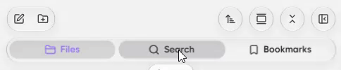
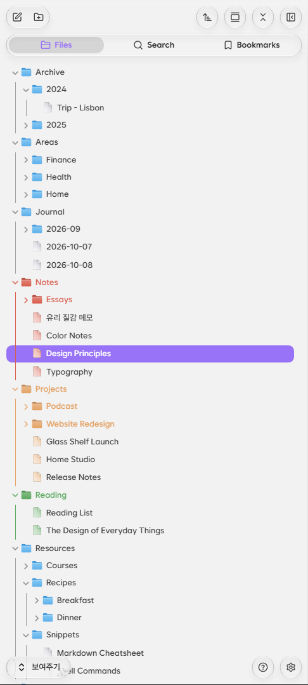
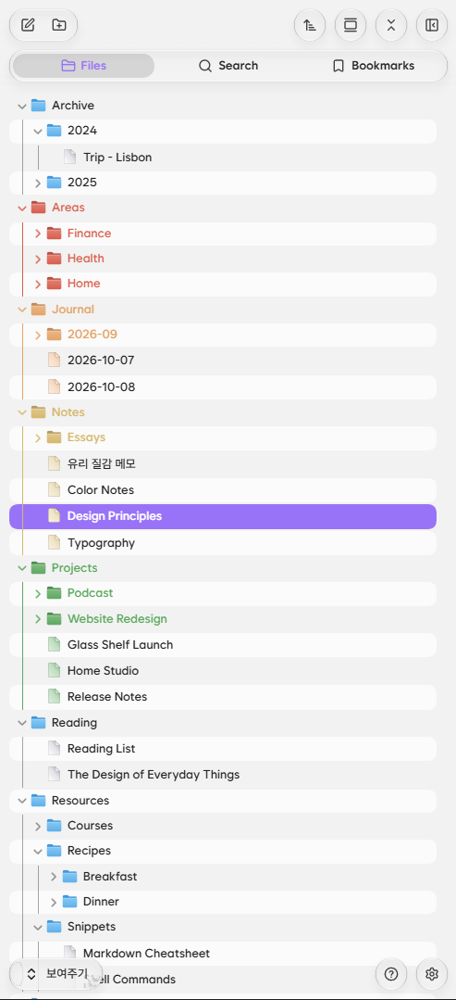
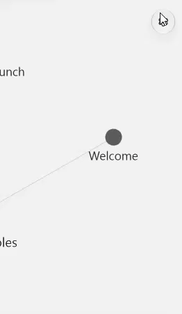
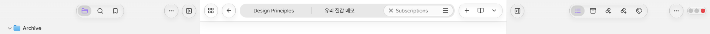

# Glass Shelf (플러그인)

[English](README.md) · **한국어**

[Glass Shelf 테마](https://github.com/ummbition/glass-shelf-theme)의 동반 플러그인입니다. 테마가 그리는 유리 표현 위에 버튼 배치, 움직임, 굴절 효과를 더합니다.

> **Glass Shelf 테마가 필요합니다.** 이 플러그인은 Glass Shelf 테마가 켜져 있을 때만 동작하고, 다른 테마에서는 아무것도 바꾸지 않습니다.

  
  

## 기능

### 레이아웃
- 사이드바 ··· 메뉴, 탭 줄의 뒤로·앞으로·읽기 모드 버튼, 탭 안 메뉴 버튼을 알약 모양으로 재배치
- 탭 줄 위에 지금 문서의 "폴더 / 파일" 경로 표시
- 아래로 스크롤하면 탭 줄을 접고 문서 제목만 남기기 (사파리식)
- 패널 탭 전환 효과(렌즈), 탭 줄 넓게, 탭 이름 표시
- Windows·Linux 창 제어 버튼을 작은 점으로 줄이기

### 유리
- 유리 투명도 0~10단계
- 틴트: 없음, 강조색, Obsidian 보라, 직접 지정 / 세기 1~10단계
- 가장자리에서 뒤 배경이 휘어 보이는 굴절 효과
- 메뉴와 같은 투명도 또는 불투명한 팝업
- 버튼이 메뉴로 펼쳐지는 모핑 애니메이션과 클릭 효과

### 세부 꾸미기
- 할 일 체크박스 모양과 색
- 파일 탐색기 폴더 아이콘 색과 폴더별 색 팔레트
- 파일 탐색기 줄무늬, 제목 아래 가로줄
- 토글·슬라이더 iOS 색상

  
  
  

### 플러그인 연동
- Kanban: Glass Shelf 형태에 맞게 디자인 수정

## 바뀐 화면 배치

플러그인을 켜면 버튼 몇 가지가 자리를 옮깁니다. 기능은 그대로이고 위치만 바뀝니다.

### 리본 메뉴

- 왼쪽 세로 리본은 숨겨지고, 리본 버튼들은 **편집창 탭 줄 맨 왼쪽의 격자 버튼(리본 메뉴)** 하나에 모입니다. 뒤로·앞으로 버튼 바로 왼쪽입니다.
- 메뉴에 보이는 버튼과 순서는 **설정 → 모양 → 리본 메뉴**에서 정한 대로 따릅니다.
- 왼쪽 패널이 닫혀 있을 때는 패널 열기 버튼도 탭 줄 맨 왼쪽에 나타납니다.
- 태블릿에서는 보관함·도움말·설정 버튼도 리본 메뉴 끝에 들어갑니다. 휴대폰은 바뀌지 않습니다.

### 사이드바 패널

- 파일 탐색기의 새 노트, 정렬, 모두 접기 같은 패널 버튼은 **패널 탭 줄의 ··· 버튼** 안으로 들어갑니다.
- 패널 탭 줄을 넓게 쓰는 설정을 켜면 ··· 대신 버튼들이 펼쳐진 채로 보입니다.

### 편집창 탭 줄

- **뒤로·앞으로**: 탭 줄 왼쪽
- **읽기/편집 전환**: 탭 줄 오른쪽, 탭 목록 버튼 왼쪽
- **더 보기(≡)**: 각 탭 안. 경로 표시를 켜면 탭 줄 위 경로 알약 안으로 옮겨집니다.

### 탭 관련 설정 위치

**설정 → 커뮤니티 플러그인 → Glass Shelf**에서 바꿀 수 있습니다.

| 설정 | 내용 |
|---|---|
| 탭 전환 효과 | 렌즈가 옮겨 가는 효과 / 효과 없이 강조색 알약 |
| 탭 줄 넓게 | 패널 탭 알약을 좌우 끝까지 넓히기 |
| 탭 이름 표시 | 패널 탭 아이콘 옆에 이름 붙이기 |
| 경로 표시 | 편집창 탭 줄 위에 "폴더 / 파일" 경로 |
| 스크롤 시 탭 줄 축소 | 아래로 스크롤하면 탭 줄을 접기 |

## 설치

1. **설정 → 모양 → 테마**에서 **Glass Shelf** 테마를 설치하고 켭니다.
2. **설정 → 커뮤니티 플러그인**에서 **Glass Shelf** 플러그인을 설치하고 켭니다.

## 지원 환경

- **PC와 안드로이드 환경을 중심으로 제작했습니다.**
- iPhone·iPad에서는 굴절 효과가 작동하지 않아, 대신 흐림(블러) 처리만 적용됩니다.
- macOS는 충분히 테스트하지 못해 일부 표현이 어색할 수 있습니다.

## 개인정보

이 플러그인은 네트워크 요청을 하지 않고, Obsidian 화면만 바꿉니다. 노트 내용을 읽거나 보내지 않습니다.

## 후원

Glass Shelf가 마음에 드셨다면 커피 한 잔으로 응원해 주세요.

## 라이선스

[MIT](LICENSE)
